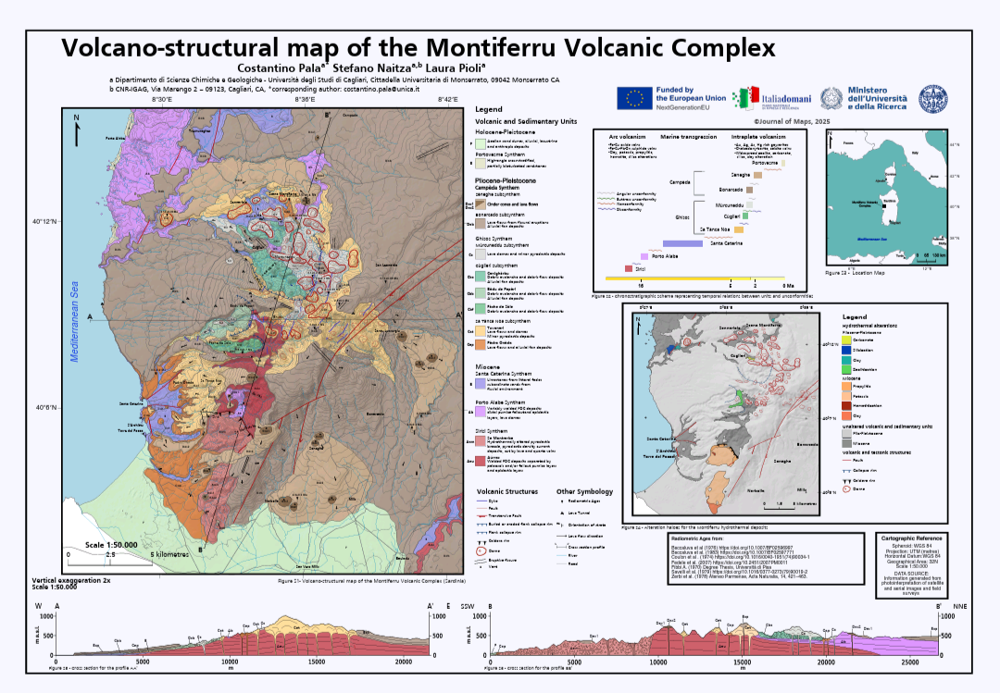
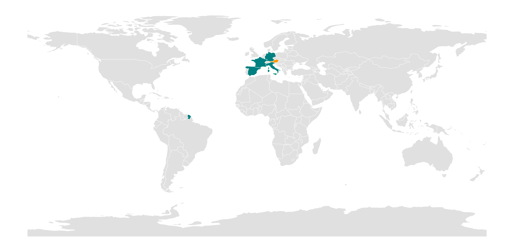

  <h1>👋 Hello! I'm Costantino! 😃</h1>
  

    
    

  <h3>Looking for a GIS Developer who knows the field as well as the code? 🌍💻</h3>
  

## 🤝 Let's Connect!
I believe the best solutions emerge where different disciplines meet. I’m looking to connect with professionals in the Geo-Tech space to exchange insights on environmental modeling and spatial analysis. Whether it’s a technical challenge, a research collaboration, or a chat about astronomy and wine—reach out!

I am open to work!

## 🔬 Current projects

  <a href="https://github.com/constantineshovel/inue" style="display: flex; flex-direction: column; align-items: center; text-decoration: none; width: 150px;">
    
    <strong style="color: #000; margin-top: 8px; font-size: 10em;">INUE</strong>
  </a>

  <a href="https://github.com/constantineshovel/SUBSTR8" style="display: flex; flex-direction: column; align-items: center; text-decoration: none; width: 150px;">
    
    <strong style="color: #000; margin-top: 8px; font-size: 10em;">SUBSTR8</strong>
  </a>

   <a href="https://github.com/constantineshovel/randomscripts" style="display: flex; flex-direction: column; align-items: center; text-decoration: none; width: 150px;">
    
    <strong style="color: #000; margin-top: 8px; font-size: 10em;">randomscripts 4 geosciences</strong>
  </a>

## 🧰 Tools & methods

---

## 🗺️ An example of what I can do with these tools... (and a lot of field work🌋)

  <a href="https://doi.org/10.1080/17445647.2026.2632982">
    
     
    <em>Published in Journal of Maps, Vol 22, issue 1. click and read!</em>
  </a>

---

## 📌 Focus
I use data and code to help communities face climate change, especially post-fire risk 🔥⛈️

> IMINT/GEOINT

> EO pipelines

> Cascading Geohazards

## 🐍 Contributions 

## 📊 STATS CENTER

  

## 📫 Contact
-  costantino.pala.geo@proton.me
- 

- ## 🗺️ Global Footprint

  
   
  <em> 🟢 Countries where I lived | 🟠 Countries visited </em>

---

## 👽Visitor's count🛸

 
  

